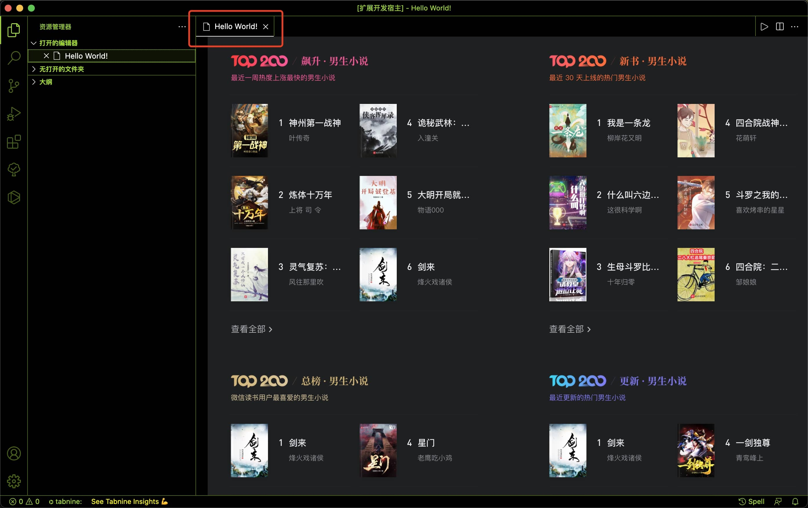

# Weixin Read / 微信读书

在 VSCode 中打开微信读书网页版


## 使用方法

1. `cmd + shift + p` or `ctrl + shift + p`
2. 随后输入 `Weixin` 或 `微信`，找到 `Weixin Read: 微信读书`，回车


## 配置项

### `panelName`
- 修改打开的标签页名称
- 示例：
  ```json
  "WeixinRead.panelName": "Hello World!"
  ```
- 效果：
    
